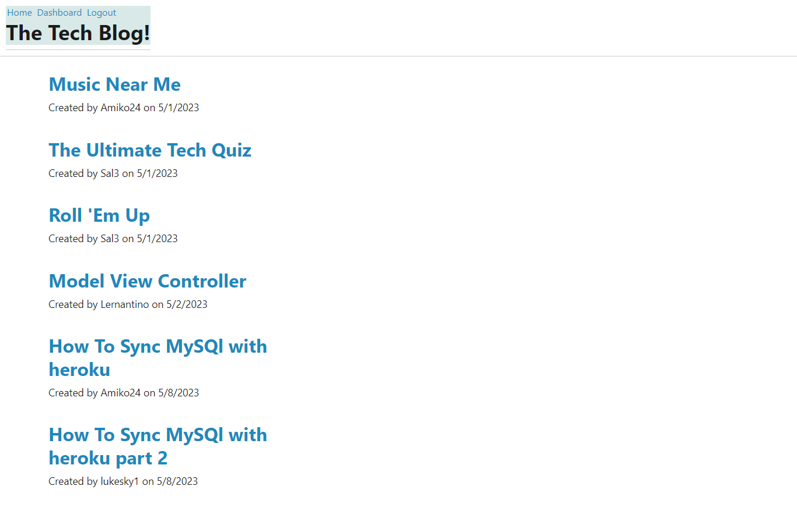

# Tech-blog-app

## Description 
The idea behind this application was to have a site in which you could read blogposts from other users about tech in general and more specifically on the topic of MVC or Model, View, Controllers. This is not just a site to read blogposts but you as a user can contribute to the conversation with comments on current blogposts from other users or create your own new posts about tech topics. I hope the comments remain positive and after all we are all learning together. This gives tech people a space to contribute, learn, and grow in an area of MVC tech. I learned that using MVC to create this app is a very complicated but good process. It must all sync together to carry out the request from the front end into a response on the back end and appear with that response on the front end. 

## Installation 
Once you open the application you will be taken to the homepage and you will see the current blogposts from other users. Then in the top left you have the homepage link, dashboard link, and login link. To go any further than the homepage you will have to click the login link and you will have the opportunity to login if you have already signed up or sign up if you have not created a signed up. Just a username and password will sign you up and then log you in for future use. You will go back to the homepage and now the link options are home, dashboard, logout. Dashboard you can create new posts that will be saved. Home you can click on a post link to read the contents of the post and leave a comment. When done navigating the site click logout. But please visit again soon. 

## Usage 

Here is the link to the app: https://stormy-hollows-61177.herokuapp.com/

## Credits
N/A

## License
N/A 